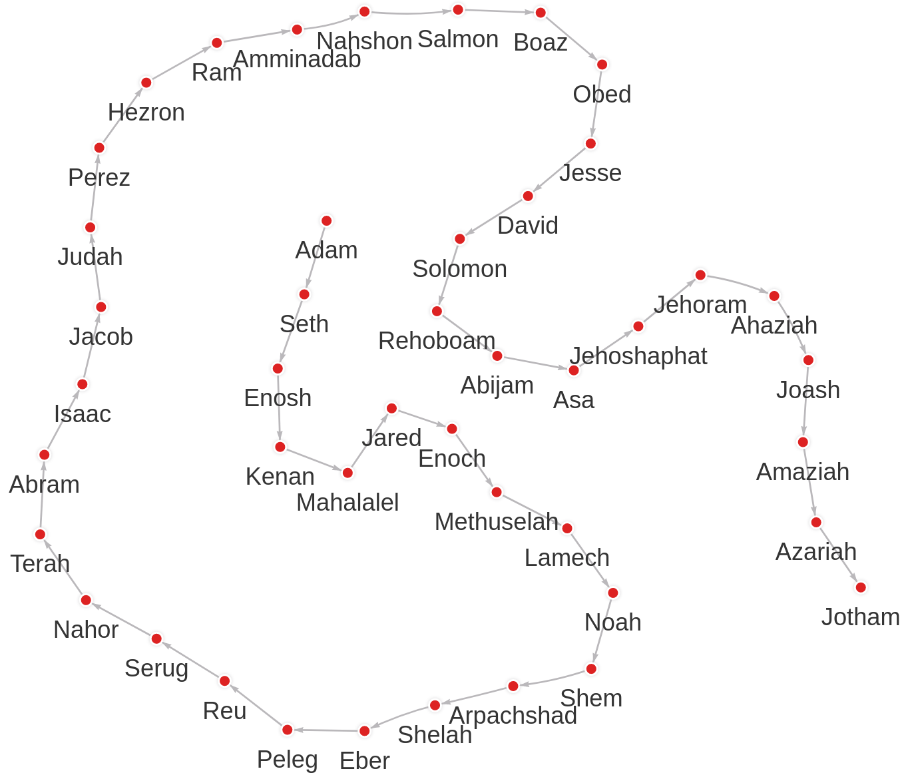
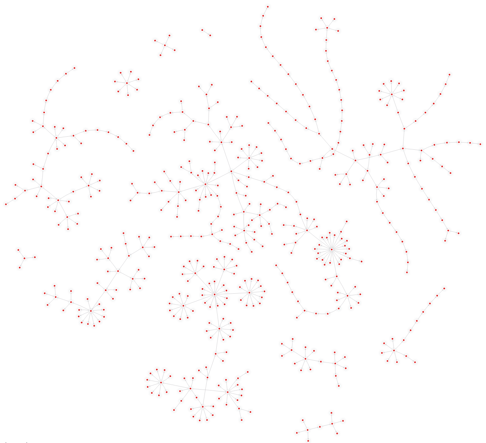
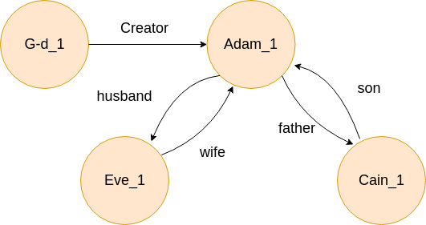

# Exploring hebrew [bible relationships](https://data.world/bradys/bibledata-personrelationship) with [memgraph](https://memgraph.com)

Reading the bible I recall struggling to remember relationships between persons and where to find references to them in the bible.
That has kept me from being immersed in the story as I would often find myself guessing who is who to whom.
Recently, I've discovered this gem of a dataset and wanted to explore it.
Memgraph turned out to be a great fit for analysing the data.
In the first part of this article we'll answer some commonly asked questions using a graph database.
In the second part you can find the step by step process of how to explore your  own datasets; from the idea to the results.

## Frequently asked questions

### What is the longest father bloodline path from Adam?
```cypher
MATCH path = ({name: "Adam_1"})
    -[* {type: "father"} ]->
    ()
RETURN path
ORDER BY size(path) DESC
LIMIT 1
```


We can see that our dataset is incomplete as the bloodline ends with *Jotham*, even though he had a son.
That is one of the charms of dealing with live data.

### What was the family tree of Adam excluding Israel (Jacob)?
```cypher
MATCH path = ({name: "Adam_1"})-[* bfs (
  e, v | v.name != "Jacob_1" and e.type = "father"
)]->()
RETURN path
```

Jacob was the son Isaac, grandson of Abram.
He had twelve sons, all of whom became the heads of their own family groups, later known as the twelve tribes of Israel.

### Which tribe of Israel had the largest family?
```cypher
MATCH ({name: "Jacob_1"})<-[{type: "son"}]-(son)
match path = (son)-[* bfs (e, v | e.type = "father")]->(a)
return son.name AS tribe, count(a) + 1 AS family_size
ORDER BY family_size DESC
```
| tribe | family_size |
| -------- | --- |
| Judah    | 163 |
| Levi     | 110 |
| Benjamin | 101 |
| Joseph   |  49 |
| Asher    |  41 |
| Issachar |  17 |
| Simeon   |  15 |
| Reuben   |   9 |
| Gad      |   8 |
| Naphtali |   5 |
| Zebulun  |   4 |
| Dan      |   2 |

```cypher
MATCH ({name: "Jacob_1"})<-[{type: "son"}]-(son)
MATCH path = (son)-[* bfs (e, v | e.type = "father")]->(a)
RETURN path
```

Can you guess which family tree belongs to whom?
Help yourself with the table provided above!

# From idea to results

## Inserting data into a graph database
Each line in the raw [dataset](https://data.world/bradys/bibledata-personrelationship) by [Brady Stepheson](https://data.world/bradys) contains information about the relationship between two persons and the reference to the bible verse.

Cleaned dataset excerpt:
```
person_id_1,relationship,person_id_2,reference
G-d_1,Creator,Adam_1,GEN 2:7
Adam_1,husband,Eve_1,GEN 3:6
Eve_1,wife,Adam_1,GEN 2:25
Adam_1,father,Cain_1,GEN 4:1
Cain_1,son,Adam_1,GEN 4:1
```

We want to turn that data into something like:



To do that we need to translate each line in the file into a [cypher](https://en.wikipedia.org/wiki/Cypher_(query_language)) query. In pseudo-code that would be:

```
create PERSON "G-d_1" if it doesn't exist
create PERSON "Adam_1" if it doesn't exist
create RELATIONSHIP "Creator" between them
```

In cypher that looks like this:
```cypher
MERGE (a: Person {name: "G-d_1"})
MERGE (b: Person {name: "Adam_1"})
CREATE (a)-[r: RELATIONSHIP {type: "Creator"}]->(b)
```

### Real data
```
person_relationship_id,person_relationship_sequence,person_id_1,relationship_type,person_id_2,relationship_category,reference_id,relationship_notes
G-d_1:Adam_1:1,1,G-d_1,Creator,Adam_1,explicit,GEN 2:7,
Adam_1:Eve_1:2,2,Adam_1,husband,Eve_1,explicit,GEN 3:6,
Eve_1:Adam_1:3,3,Eve_1,wife,Adam_1,explicit,GEN 2:25,
Adam_1:Cain_1:4,4,Adam_1,father,Cain_1,explicit,GEN 4:1,
Cain_1:Adam_1:5,5,Cain_1,son,Adam_1,explicit,GEN 4:1,
```

Inserting into the database
```cypher
LOAD CSV FROM '/relationship.csv' WITH HEADER AS row
MERGE (a: Person {name: row.person_id_1})
MERGE (b: Person {name: row.person_id_2})
CREATE (a) - [:RELATIONSHIP {
  type: row.relationship_type,
  category: row.relationship_category,
  notes: row.relationship_notes,
  reference: row.reference_id
}] -> (b)
```

## Testing data integrity
### Ad hoc
#### Every outgoing edge has to be paired with a matching incoming edge
We can check if every *father* and *mother* relationship has a *son* or *daughter* matching relationship.
We can do the same for *wives* and *husbands*, *brothers* and *sisters*, etc.
The following query returns all *Persons* that have an unequal amount of incoming versus outgoing edges:

```cypher
MATCH (person)
OPTIONAL MATCH ()-[incoming]->(person)
WITH person, count(incoming) as ins
OPTIONAL MATCH (person)-[outgoing]->()
WITH person, ins, count(outgoing) as outs
WHERE outs != ins
RETURN person.name
```

Result:
```
G-d_1, Naamah_16, Naamah_1, Eve_3, Eve_1, Adam_1
```

Upon closer inspection we can see that *Adam_1* is missing a *created by* edge towards *G-d_1*, and that *Naamah_16* and *Namaah_1* are the same person (same goes for *Eve's*).
I've reported the errors to the author but in the mean time we can make these changes ourselves.
We can do that with cypher or change the data directly in the csv.

```cypher
MATCH (g {name: "G-d_1"})-[relationship]->(adam {name: "Adam_1"})
CREATE (adam)-[new_relationship: RELATIONSHIP]->(g)
SET new_relationship=relationship
SET new_relationship.type="created by";
```

### Using domain knowledge
If you have read the bible some things might come out to you as odd straight away.
For example, when I was executing the queries in the first part of the article I noticed that *Benjamin* was the son of *Joseph* and *Rachel*, but I know that can't be right since *Joseph* is the brother of *Benjamin*.
Also, I have noticed that *Nahshon_1* and *Nahshon_2* must be the same person as there was no clear bloodline from *Adam* to *David*!
In general for these kinds of observations you will usually need someone who is an expert in the field.
These methods won't work well if the number of entries is too big.
In those cases you'll have to accept small discrepancies between the data and the truth.
