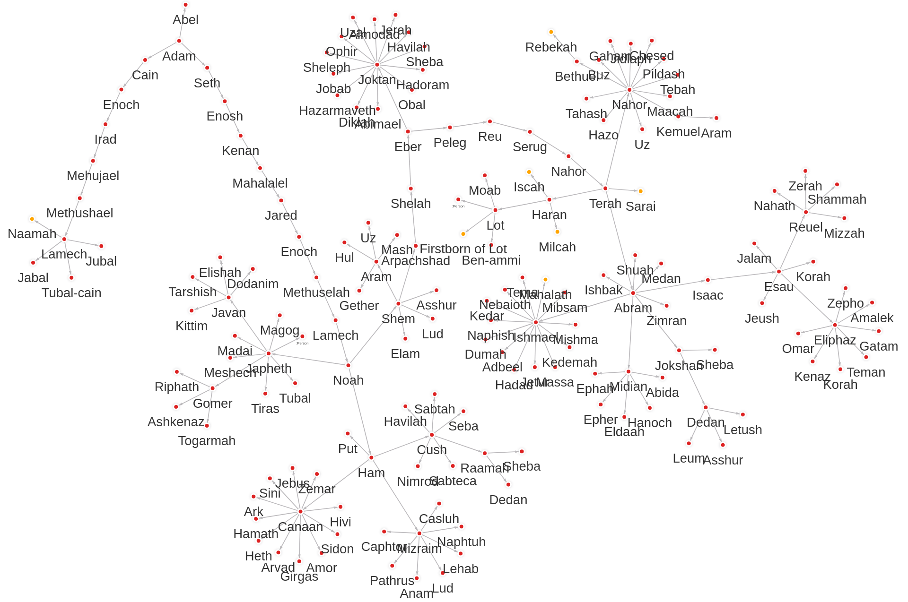

# Exploring the Hebrew [Bible relationships](https://data.world/bradys/bibledata-personrelationship) with [Memgraph](https://memgraph.com)

### Introduction

Reading the Bible I recall struggling to remember relationships between persons and where to find references to them in the Bible.
That has kept me from being immersed in the story as I would often find myself guessing who is who to whom.
Recently, I've discovered this gem of a dataset and wanted to explore it.
Memgraph turned out to be a great fit for analysing the data.
In the first part of this article we'll answer some commonly asked questions using a graph database.
In the second part you can find the step by step process of how to explore your own datasets; from idea to results.

### Data model
The data collected by [Brady Stepheson](https://data.world/bradys) contains information about persons in the Bible and the relationships between them.
The dataset is incomplete!
At the time of writing the data is collected up to the second book of Chronicles, verse 20.
If you want to know more about the format of data input data and how we imported it into Memgraph, hop to the second part of this article.

Person:
  - id ["Adam_1", "Jotham_2", "Jotham_3", ...]
  - name ["Adam", "Eve", "Jacob", ...]
  - notes
  - sex ["male", "female"]
  - tribe ["Judah", "Levi", "Manasseh", "Ammonite", ...]

RELATIONSHIP:
  - type ["father", "half-brother", "killer", "killed by", ...]
  - category ["logical", "explicit", "implicit"]
  - reference ["GEN 4:19", "2KI 15:13", ...]

## Frequently asked questions

Every question in this section will be followed by:
  - a short description
  - an image from [MemgraphLab](https://memgraph.com/download#Lab-download) (Memgraph's default data browser)
  - a [cypher query](https://neo4j.com/developer/cypher/) (SQL-like declarative query language for graph databases)

### What is the longest father bloodline path from Adam?
The image shows the longest father-line path from Adam (created by G-d) all the way to Jotham, the son of Azariah.
We can see that our dataset is incomplete since the family tree of Uzziah, son of Amaziah, should be longer (all the way to Yeshua).
The Amaziah -> Uzziah relationship is first noted in the second book of Chronicles 26:1, but the dataset is up to 2CH 20.
This is one of the charms of dealing with live data.

```cypher
MATCH path = ({name: "Adam"})
    -[* {type: "father"} ]->
    ()
RETURN path
ORDER BY size(path) DESC
LIMIT 1
```

### What is the family tree of Adam excluding Israel (Jacob)?
The image shows Adams family tree up to Jacob, the son of Isaac, grandson of Abram.
Do note that apart from the families of Jacob; Moabites, Ammonites (sons of Lot), and other tribes were also present in later parts of the old testament.
Female nodes in the graph are coloured orange, and male nodes are coloured red.


```cypher
MATCH path = ({id: "Adam_1"})-[* bfs (
  e, v | v.id != "Jacob_1" AND e.type = "father"
)]->()
RETURN path
```

### Which tribe of Israel had the largest family?
Jacob had twelve sons, all of whom became the heads of their own family groups, later known as the twelve tribes of Israel.
The tribe of Joseph split into two half-tribes: the tribe of Manasseh and the tribe of Ephraim.
In the following table we can see the size of each tribe up to the second book of Chronicles.
`size_by_blood` is calculated by counting all the nodes we can reach from the sons of Jacob using only the *father* relationships.
`size_by_marriage` is calculated by counting all the instances in the Bible where a person is explicitly noted to be a part of a certain tribe.

| tribe | size_by_blood | size_by_marriage |
| ----- | ------------- | ---------------- |
| Judah    | 163 | 294 |
| Levi     | 110 | 323 |
| Benjamin | 101 | 189 |
| Joseph   |  49 |  95 |
| Asher    |  41 |  47 |
| Issachar |  17 |  26 |
| Simeon   |  15 |  38 |
| Reuben   |   9 |  34 |
| Gad      |   8 |  44 |
| Naphtali |   5 |  13 |
| Zebulun  |   4 |  13 |
| Dan      |   2 |  14 |

```cypher
MATCH ({id: "Jacob_1"})<-[{type: "son"}]-(son)
MATCH path = (son)-[* bfs (e, v | e.type = "father")]->(a)
WITH son.name as tribe, count(a) + 1 AS size_by_blood
OPTIONAL MATCH (person)
WHERE person.tribe IN
CASE tribe
  WHEN "Joseph" THEN ["Manasseh", "Ephraim"]
  ELSE [tribe]
END
RETURN tribe, size_by_blood, count(person) AS size_by_marriage
ORDER BY size_by_blood DESC, size_by_marriage DESC
```

The image shows the twelve tribes of Israel up to 2CH 20:1 by father bloodline.
Can you guess which family tree belongs to whom?
Help yourself with the table provided above!

```cypher
MATCH ({id: "Jacob_1"})<-[{type: "son"}]-(son)
MATCH path = (son)-[* bfs (e, v | e.type = "father")]->(a)
RETURN path
```

# From idea to results

## Inserting data into a graph database
Each line in the raw [dataset](https://data.world/bradys/bibledata-personrelationship) by [Brady Stepheson](https://data.world/bradys) contains information about the relationship between two persons and the reference to the Bible verse.

Cleaned dataset excerpt:
```
person_id_1,relationship,person_id_2,reference
G-d_1,Creator,Adam_1,GEN 2:7
Adam_1,husband,Eve_1,GEN 3:6
Eve_1,wife,Adam_1,GEN 2:25
Adam_1,father,Cain_1,GEN 4:1
Cain_1,son,Adam_1,GEN 4:1
```

We want to turn that data into something like:


To do that we need to translate each line in the file into a [cypher](https://en.wikipedia.org/wiki/Cypher_(query_language)) query. In pseudo-code that would be:

```
create PERSON "G-d_1" if it doesn't exist
create PERSON "Adam_1" if it doesn't exist
create RELATIONSHIP "Creator" between them
```

In cypher that looks like this:
```cypher
MERGE (a: Person {id: "G-d_1"})
MERGE (b: Person {id: "Adam_1"})
CREATE (a)-[r: RELATIONSHIP {type: "Creator"}]->(b)
```

### Real data
```
person_relationship_id,person_relationship_sequence,person_id_1,relationship_type,person_id_2,relationship_category,reference_id,relationship_notes
G-d_1:Adam_1:1,1,G-d_1,Creator,Adam_1,explicit,GEN 2:7,
Adam_1:Eve_1:2,2,Adam_1,husband,Eve_1,explicit,GEN 3:6,
Eve_1:Adam_1:3,3,Eve_1,wife,Adam_1,explicit,GEN 2:25,
Adam_1:Cain_1:4,4,Adam_1,father,Cain_1,explicit,GEN 4:1,
Cain_1:Adam_1:5,5,Cain_1,son,Adam_1,explicit,GEN 4:1,
```

Inserting into the database
```cypher
LOAD CSV FROM '/relationship.csv' WITH HEADER AS row
MERGE (a: Person {id: row.person_id_1})
MERGE (b: Person {id: row.person_id_2})
CREATE (a)-[:RELATIONSHIP {
  type: row.relationship_type,
  category: row.relationship_category,
  notes: row.relationship_notes,
  reference: row.reference_id
}]->(b)
```

Additionally we can add name, sex, tribe and other meta data to each person using the [persons dataset](https://data.world/bradys/bibledata-person).
```cypher
LOAD CSV FROM "/person.csv" WITH HEADER AS row
MERGE (node: Person {id: row.person_id})
SET node += {
  name: row.person_name,
  sex: row.sex,
  tribe: row.tribe,
  notes: row.person_notes
}
```

## Testing data integrity
### Without domain specific knowledge
#### Every outgoing edge has to be paired with a matching incoming edge
We can check if every *father* and *mother* relationship has a *son* or *daughter* matching relationship.
We can do the same for *wives* and *husbands*, *brothers* and *sisters*, etc.
The following query returns all *Persons* that have an unequal amount of incoming versus outgoing edges:

```cypher
MATCH (person)
OPTIONAL MATCH ()-[incoming]->(person)
WITH person, count(incoming) as ins
OPTIONAL MATCH (person)-[outgoing]->()
WITH person, ins, count(outgoing) as outs
WHERE outs != ins
RETURN person.name
```

Result:
```
G-d_1, Naamah_16, Naamah_1, Eve_3, Eve_1, Adam_1
```

Upon closer inspection we can see that *Adam_1* is missing a *created by* edge towards *G-d_1*, and that *Naamah_16* and *Naamah_1* are the same person (same goes for *Eve's*).
I've reported the errors to the author but in the mean time we can make these changes ourselves.
We can do that with cypher or change the data directly in the CSV file.

```cypher
MATCH (g {id: "G-d_1"})-[relationship]->(adam {id: "Adam_1"})
CREATE (adam)-[new_relationship: RELATIONSHIP]->(g)
SET new_relationship=relationship
SET new_relationship.type="created by";
```

### Using domain knowledge
If you have read the Bible some things might come out to you as odd straight away.
For example, when I was executing the queries in the first part of the article I noticed that *Benjamin* was the son of *Joseph* and *Rachel*, but I know that can't be right since *Joseph* is the brother of *Benjamin*.
Also, I have noticed that *Nahshon_1* and *Nahshon_2* must be the same person as there was no clear bloodline from *Adam* to *David*!
In general for these kinds of observations you will usually need someone who is an expert in the field.
These methods won't work well if the number of entries is too big.
In those cases you'll have to accept small discrepancies between the data and the truth.

## Conclusion
This has been a concise how-to guide on exploring real world data with all the charms that go with it.
We hope you enjoyed reading it as much as we enjoyed writing it.
The dataset will continue to be expanded.
Download the latest version and you might get better results.
Head over to the download page to start exploring your own data or play with a plethora of datasets we [provide](https://playground.memgraph.com).
Good luck and stay sharp!
